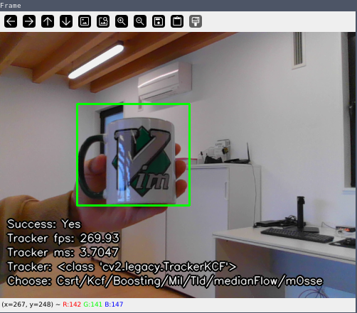

# tracking-cv2 

This repository implements a simple python script with all `opencv` trackers. 



Use it to test them or build further programs/benchmarkings.


## Setup 

Install python dependencies with `pip3 install -r requirements.txt`. If you want to use v4l2loopback, you need to [install opencv with gstreamer support](https://gist.github.com/pabsan-0/1bf9d69f978e437692ef10cb5d77e466). A virtual environment is wildly recommended if you plan on building `opencv` from source. The script works best with default backend. 

```
# Install all within a venv
echo venv >> .gitignore
python3 -m venv venv
source venv/bin/activate
pip3 install -r requirements.txt

# Optionally build yourself if you like
pip3 install opencv_contrib_*.whl
```

## Usage

Run the program with `./main.py`. From there:

- Press `s` to select a starting bounding box
- Press `c` to cancel an ongoing selsection.
- Press `q` to quit
- Press any of the uppercase-letters shown in the display to change the tracker at any time.

Note that wildly smashing buttons breaks the trackers, just sometimes. 


## Diving deeper 

- Some `opencv` versions pack the trackes in a `cv2.legacy` modules, some don't. Figure these out for your current version by checking in an interpreter. 
- If building `opencv` from source, remember to move out of the source dir afterwards, else `import cv2` will be masked by a dir with that name and you'll find only dunder methods.
- You need [v4l2loopback](https://github.com/umlaeute/v4l2loopback) to loop back video through a virtual device. Research this on your own. 
